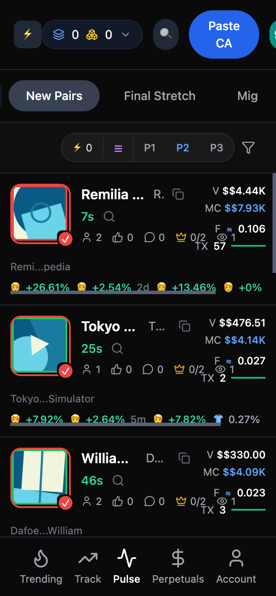
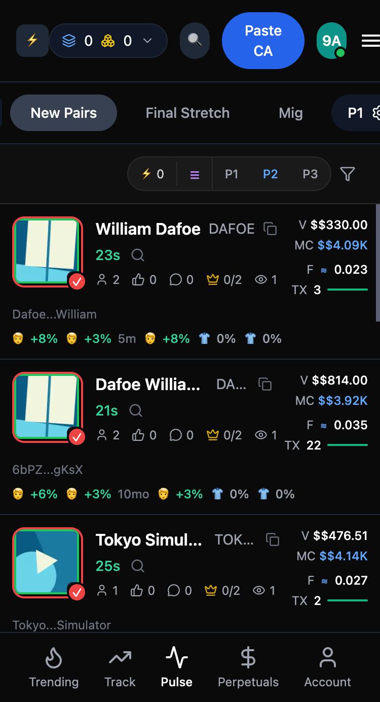
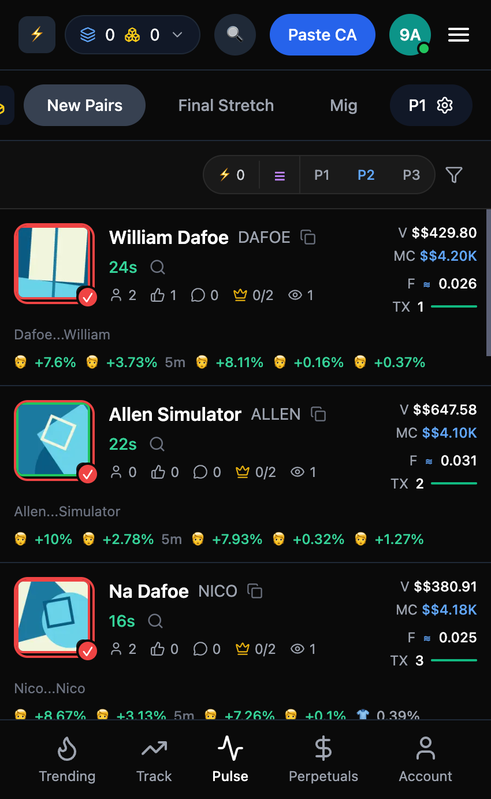
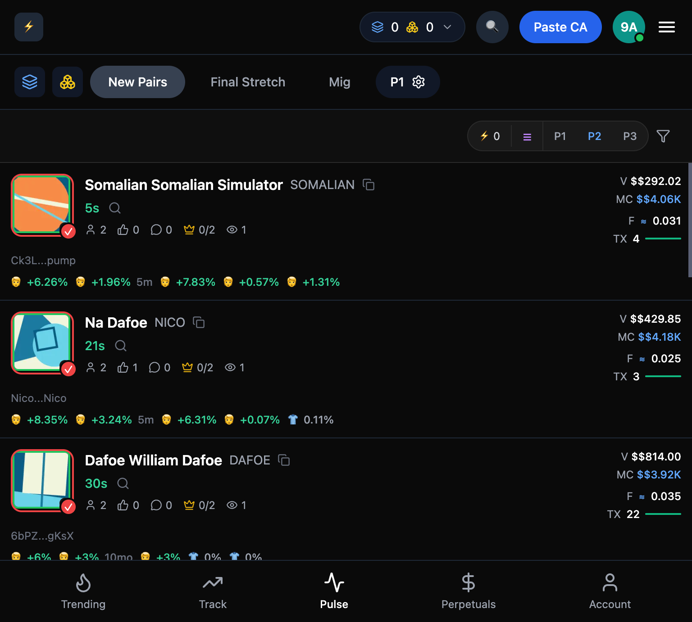
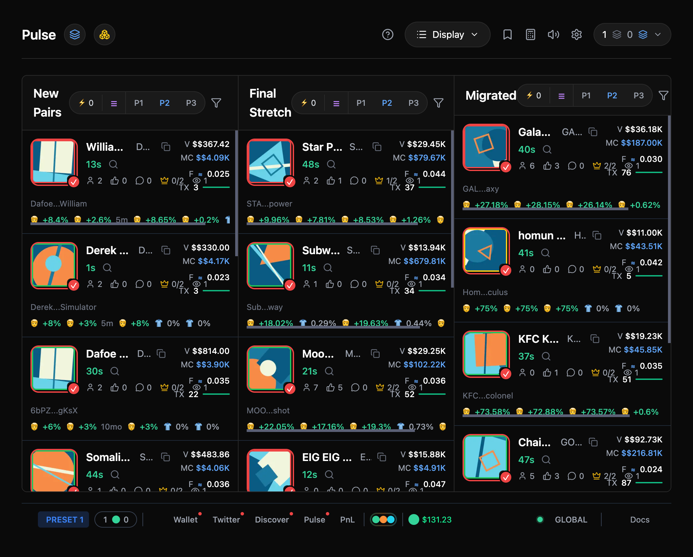
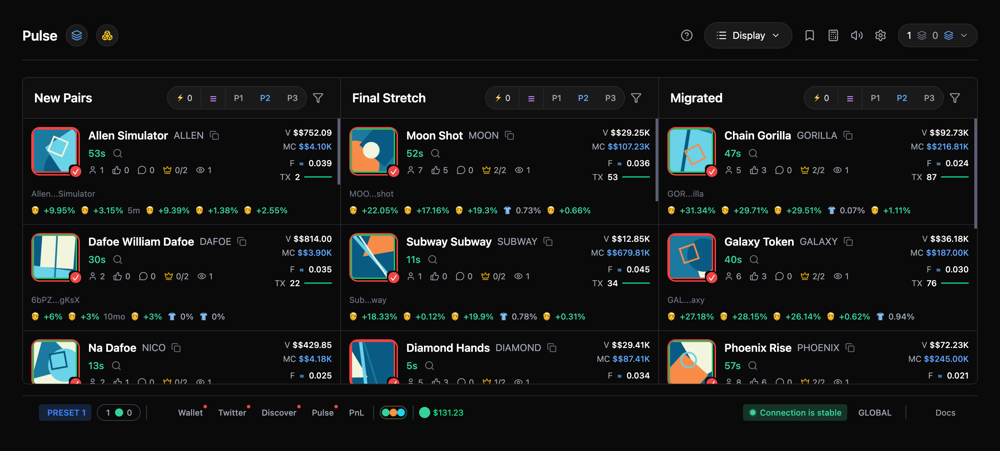

# Pulse - Token Discovery Table

A pixel-perfect replica of Axiom Trade's token discovery table built with Next.js 14, TypeScript, and Tailwind CSS, featuring a fully responsive layout validated with auto-layout snapshots down to 320px width.

## Features

### Core Features
- ✅ Three token columns: New Pairs, Final Stretch, Migrated
- ✅ Interactive components: Popover, Tooltip, Modal
- ✅ Sorting functionality for each column
- ✅ Hover effects and click actions
- ✅ Real-time price updates with WebSocket mock
- ✅ Smooth color transitions on price changes
- ✅ Multiple loading states: Skeleton, Shimmer, Progressive Loading
- ✅ Error boundaries for graceful error handling

### Technical Stack
- **Framework**: Next.js 14 (App Router)
- **Language**: TypeScript (strict mode)
- **Styling**: Tailwind CSS
- **State Management**: Redux Toolkit
- **Data Fetching**: React Query (TanStack Query)
- **UI Components**: Radix UI primitives
- **Architecture**: Atomic Design Pattern

## Project Structure

```
├── app/
│   ├── globals.css          # Global styles and animations
│   ├── layout.tsx           # Root layout with providers
│   └── page.tsx             # Main page
├── components/
│   ├── ui/                  # Atomic UI components
│   │   ├── button.tsx
│   │   ├── tooltip.tsx
│   │   ├── popover.tsx
│   │   ├── modal.tsx
│   │   ├── skeleton.tsx
│   │   └── error-boundary.tsx
|   ├── bottom-status-bar.tsx
|   ├── token-card-skeleton.tsx
|   ├── token-image.tsx
│   ├── token-card.tsx       # Token card component
│   ├── token-column.tsx     # Column component with sorting
│   ├── token-discovery-table.tsx  # Main table component
│   ├── price-indicator.tsx  # Price change indicator with animations
│   └── providers.tsx        # Redux & React Query providers
├── lib/
│   ├── types.ts             # TypeScript type definitions
│   ├── utils.ts             # Utility functions
│   ├── store.ts             # Redux store configuration
│   ├── slices/
│   │   └── tokenSlice.ts    # Redux slice for token state
│   ├── hooks/
│   │   ├── useAppDispatch.ts
│   │   ├── useAppSelector.ts
│   │   ├── useWebSocket.ts  # WebSocket hook (for production)
│   │   └── useMockWebSocket.ts  # Mock WebSocket for development
│   └── mockData.ts          # Mock token data
└── package.json
```

## Getting Started

### Prerequisites
- Node.js 18+ 
- npm or yarn

### Installation

```bash
# Install dependencies
npm install

# Run development server
npm run dev

# Build for production
npm run build

# Start production server
npm start
```

Open [http://localhost:3000](http://localhost:3000) in your browser.

## Performance Optimizations

- **Memoization**: All components use `React.memo` to prevent unnecessary re-renders
- **Code Splitting**: Automatic code splitting with Next.js App Router
- **Lazy Loading**: Components loaded on demand
- **Optimized Re-renders**: Redux selectors prevent unnecessary updates
- **Smooth Animations**: CSS transitions with GPU acceleration
- **No Layout Shifts**: Fixed dimensions and skeleton loaders

## Responsive Design

## Responsive Layout Validation (Auto-Layout Snapshots)

The layout has been fully validated across mobile, tablet, and desktop breakpoints.  
Below are real screenshots captured using Chrome DevTools device emulation.

### Mobile Views

| Device | Width | Screenshot |
|------|------|-----------|
| Mobile S | 320px |  |
| Mobile M | 375px |  |
| Mobile L | 425px |  |

### Tablet View

| Device | Width | Screenshot |
|------|------|-----------|
| Tablet | 768px |  |

### Desktop Views

| Device | Width | Screenshot |
|------|------|-----------|
| Desktop | 1024px |  |
| Large Desktop | 1440px |  |

### Responsive Behavior Summary

- **≤ 425px (Mobile)**  
  - Single-column layout  
  - Tab-based navigation (New Pairs / Final Stretch / Migrated)  
  - Vertical scrolling enabled per column  
  - Optimized spacing and touch-friendly controls  

- **768px – 1023px (Tablet)**  
  - Adaptive layout with improved spacing  
  - Scroll preserved with flex-based height handling  

- **≥ 1024px (Desktop)**  
  - Three-column layout  
  - Independent vertical scrolling per column  
  - Full header controls visible  

All snapshots were captured using Chrome DevTools with no CSS overrides.


## Code Quality

- ✅ TypeScript strict mode enabled
- ✅ All files under 180 lines of code
- ✅ Comprehensive error handling
- ✅ Documented complex logic
- ✅ DRY principles followed
- ✅ Atomic architecture for reusability


To test:
```bash
npm run build
npm start
```

## Deployment

### Vercel Deployment

1. Push code to GitHub
2. Import project in Vercel
3. Deploy automatically

The project is configured for Vercel with:
- Automatic builds on push
- Environment variables support
- Edge runtime optimization

## Real-time Updates

The application includes a mock WebSocket implementation that simulates real-time price updates. In production, replace `useMockWebSocket` with `useWebSocket` and configure your WebSocket server.

## Testing Responsive Layout

The application is fully responsive and tested down to 320px width. To test:

1. Open Chrome DevTools
2. Use Device Toolbar (Cmd/Ctrl + Shift + M)
3. Test at breakpoints: 320px, 768px, 1024px, 1920px

### Responsive Breakpoints
- **320px - 767px**: Single column layout (mobile)
- **768px - 1023px**: Two column layout (tablet)
- **1024px+**: Three column layout (desktop)

<!-- ## Demo Video

A 1-2 minute demo video showcasing all features is available at: [YouTube Link - To be added]

The video demonstrates:
- Three-column token display
- Interactive components (popover, tooltip, modal)
- Sorting functionality
- Real-time price updates with animations
- Responsive design across breakpoints
- Loading states and error handling -->

## Deliverables Checklist

- ✅ GitHub repository with clean commits
- ✅ Vercel deployment ready (see DEPLOYMENT.md)
- ⏳ 1-2 minute public YouTube video (to be created)
- ✅ Responsive layout complete down to 320px width (auto-layout snapshots attached)
- ✅ README with comprehensive documentation

## License

MIT

## Author

Built for Eterna Assessment


